Todo: Redo as no need for threaded inserts.

Todo: One of the printed parts does need supports.

Todo: Better blurb at start

Todo: Shorten the stepper motor wires whole section

Todo: Arduino Library section lol spelling mistake need to add downloading the github repository

Todo: Compiling and uploading source files using Ardunio IDE, need section about putting into DFU mode.

Todo: Using STMCube

Todo: Installing ASCOM driver

Todo: How to use with ASCOM.

# Realta Scope Tech EBBfocuser

## Project goals.

+ Truley open source code i.e. do what you want with it.
+ Using open hardware only i.e. schematic available.
+ Firmware created using Arduino IDE with full guide to get it working with the EBB.

## What you need to buy.

### Stepper motor

I have used a 23mm thick Nema 17 stepper motor like this 17HS4023. 

However, any NEMA stepper motor thicker than this will work but you are limited to 1.5A per phase by the EBB42 stepper motor driver. Even thinner motors will work but you will have a hard time mounting them as the case will foul most mounting brackets. The FreeCAD file containing the parts is included in this repository so can be edited to provide a spacer to pad out the difference in width if needed. 

### BigTreeTech EBB36 

There are two versions of this, one with an accelerometer and one without, both will work but the accelerometer version is twice as expensive and no use of it is made in this project. 

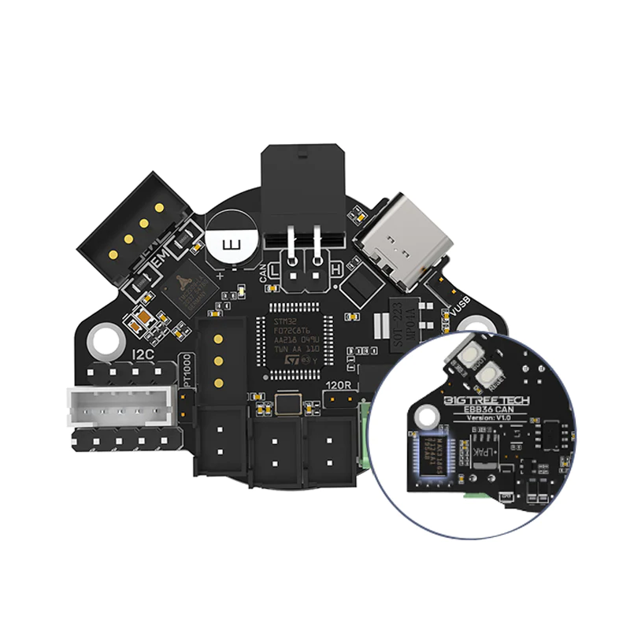

### M3 Hex bolts

To secure the EBB36 you will need 4 25mm long M3 bolts and 2 5mm M3 bolts while the ones for the stepper motor depend on how thick the one you buy is. The original bolts will not reach through the combined thickness of the case and motor so you will need 2 replacement ones. I found that for the 23mm thick motor I could use 22mm long bolts.  

### Optional: Crimping tools and ferrules

The EBB36 focuser comes with all the accessories you need to connect it up it comes with the cable fittings needed to be added to wires to fit in its sockets and the metal pins too. However you will need to crimp these onto the wires yourself and a dupont compatable crimping tool greatly helps.

However it is possible to crimp using Needle Nose Pliers. 

I also made use of ferrules for terminating the dew heater wires used in the screw terminals.

## What you need to 3D print.

The parts are designed to be printed easily on a printer using a 0.8mm nozzle so should be easy prints on any printer using a smaller nozzle. 

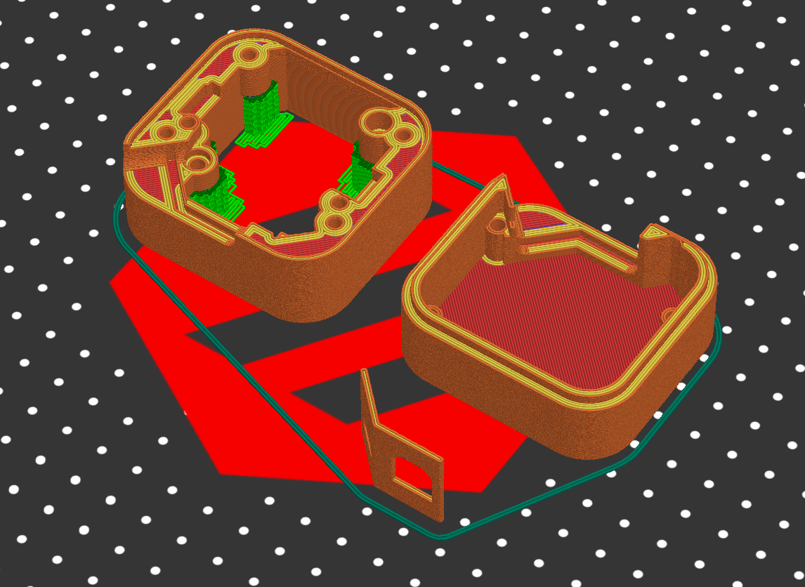

The bottom section of the case needs supports to print well, I used the support paint tool and the smart fill option to select the faces needing supports using Prusa Slicer.

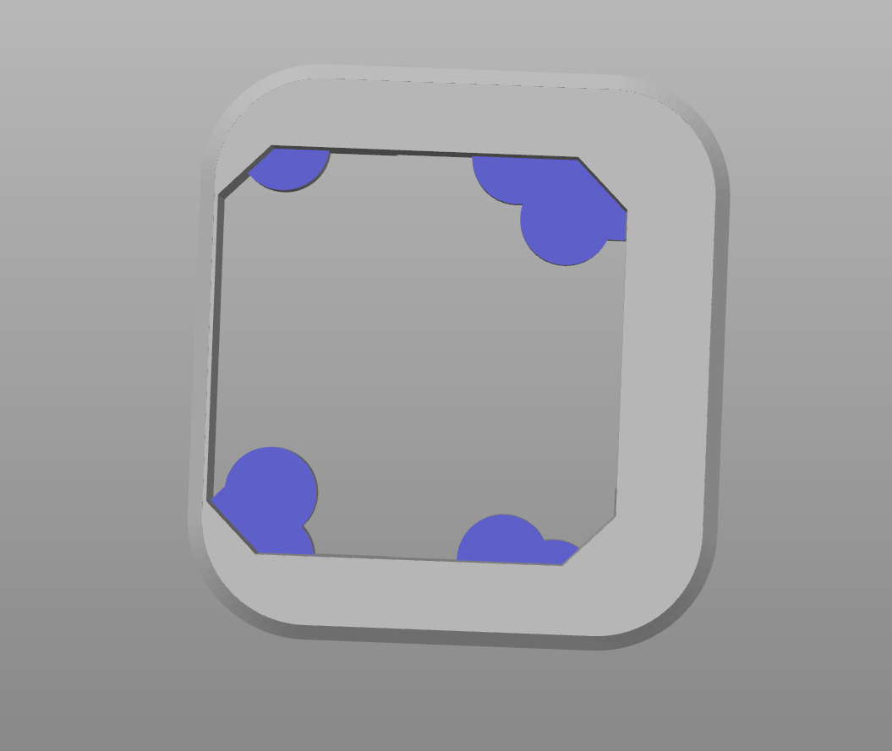

### Notes on filament type.

Stepper motors will get warm when opperating and even when not moving they are being held in place by powered magnetic fields. They are designed to cope with very very high temperatures. The firmware provided does make use of the TMC2209's CoolStep technology which greatly lowers the current drawn when not moving however the motor will still get warm to the touch, around 40c to 50c are common. This means you really should think twice about using a filament such as PLA which will start going floppy around this temperature. PETG would be better but ABS or ASA would be best. 

## Assembling the case.

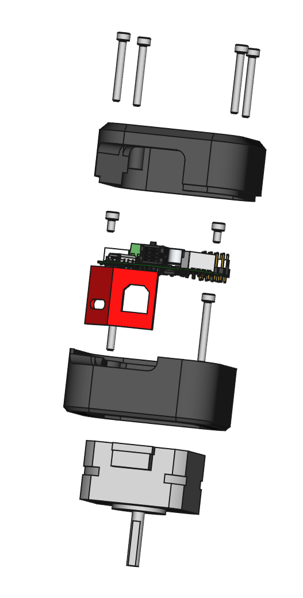

### Shorten the stepper motor wires

Todo: Warning about checking the wiring order.

Todo: Reminder about crimping

Todo: Suggested length.

### Insert NEMA 17 stepper motor

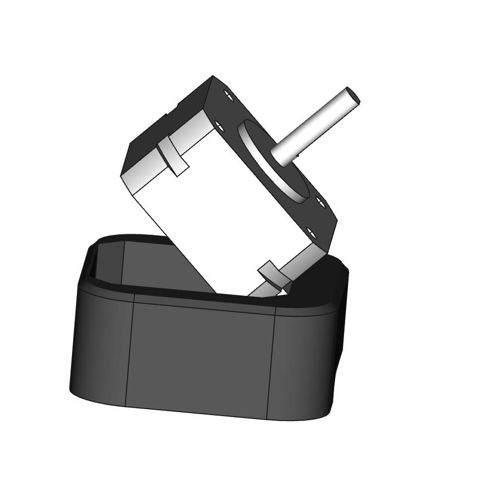

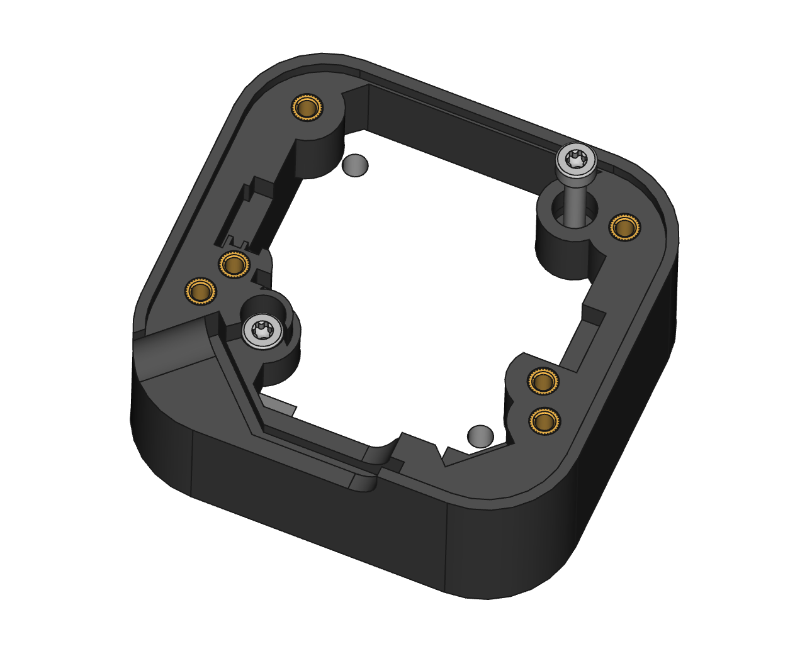

### Postion Face Plate

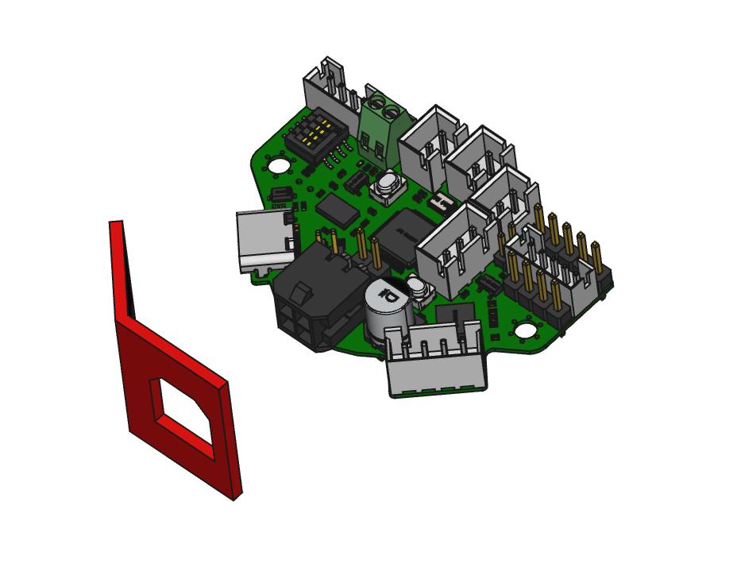

### Fit EBB36 PCB

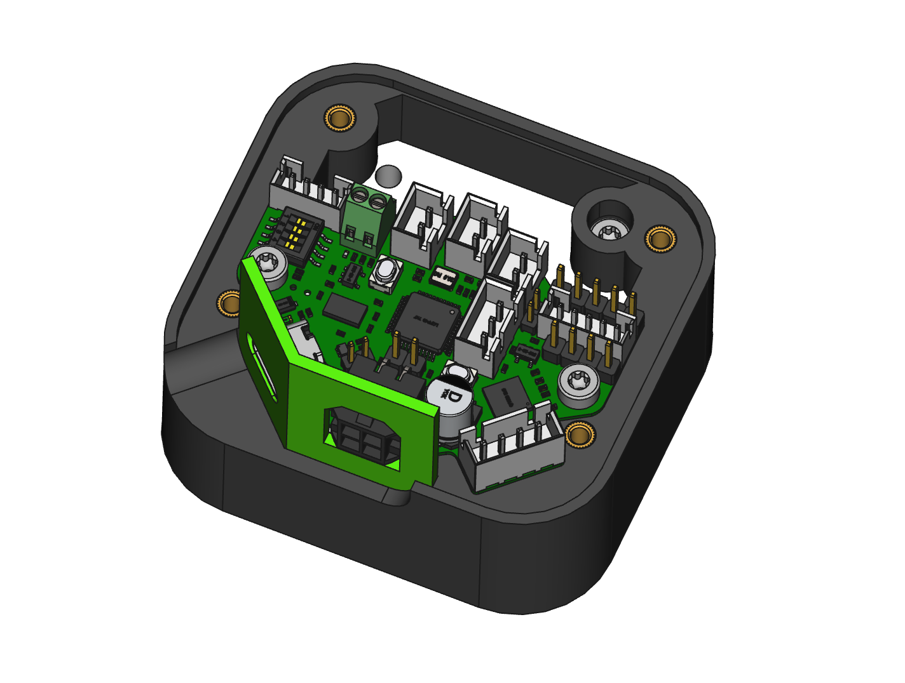

### Todo: Insert motor wire connector

### Fit top of case

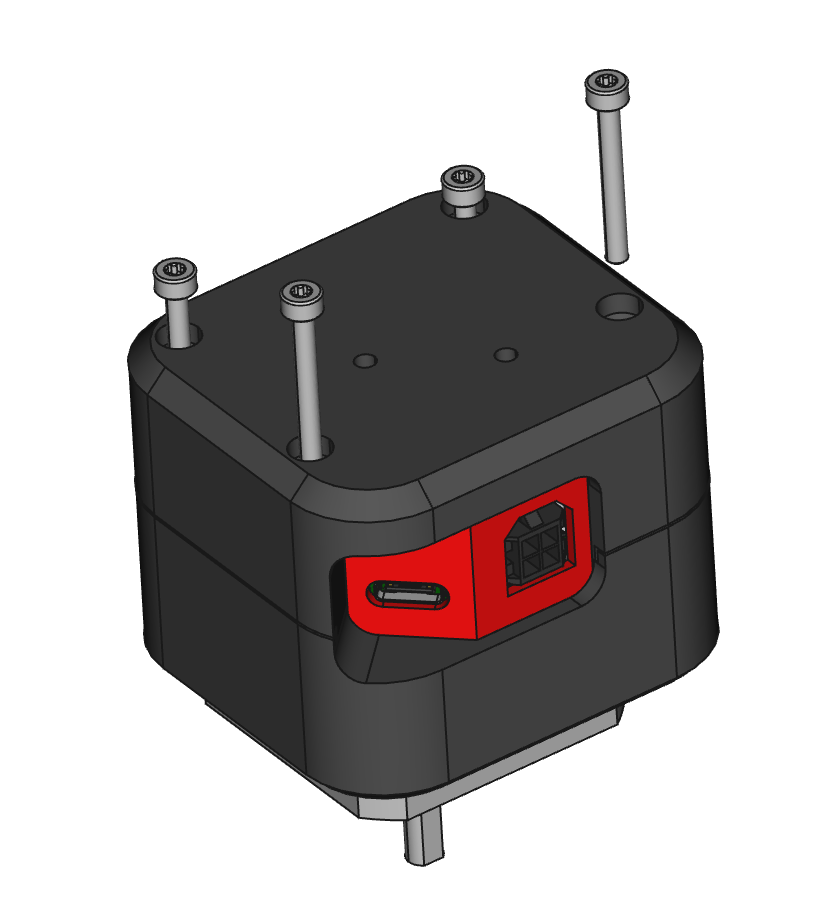

## Setting up the Arduino IDE for use with EBB36.

### Install the Arduino IDE.

The latest Ardunio IDE can be found here.

https://www.arduino.cc/en/software

When you start the IDE for the first time you will be asked to allow it access to the internet, please allow it to do this as it will download various drivers and you will need this functionality later on to install some libaries. 

### Add additional Boards Managers URLs

Go to file -> preferences and add stm32duino

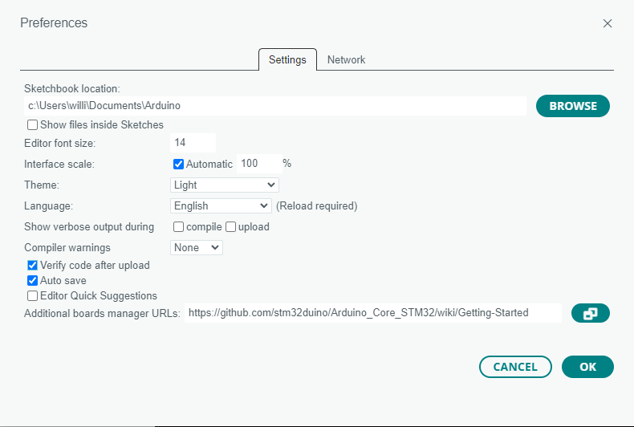

and add 

https://github.com/stm32duino/Arduino_Core_STM32/wiki/Getting-Started to the "additional Boards Managers" section at the bottom. Wait for the definitions to download

### User board manager to add stm32duino

Use the "tools" -> Board manager menu at the top to add the STM32 boards to the IDE.

This opens a panel on the left hand side, in this search for "STM". 

### Select the and configure the board

Use the "tools" menu again to select "3D printer boards"; 

tools -> STM32 MCU based boards -> 3D printer boards

Then use the newly added menus to select the board part number 

And upload method

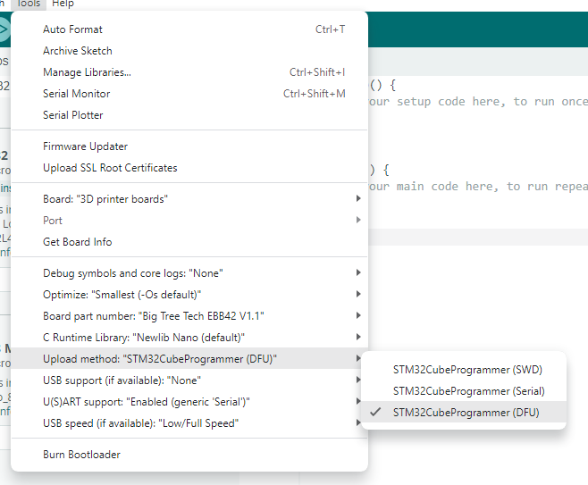

Finally the board is ready to be used in Arduino IDE!

### Install STM32CubeProgrammer

We still aren't done installing software, when the Arduino IDE uploads the file to the EBB42 board it will first try to compile it and when it does that it reaches out to the STM32 compiler which wont exist yet on your computer! In order for this to work we need to install STM32CubeProgrammer which can be downloaded from.

https://www.st.com/en/development-tools/stm32cubeprog.html

### Adding in required libraries.

In order to comunicate with the TMC2209 stepper driver on the EBB32 PCB we need computer code, I didn't write it myself I used a library that was written by teemuatlut, here's a link to his projects github https://github.com/teemuatlut/TMCStepper however you won't need to download anything from there as we can do that via the Arduino IDE itself. 

To do this we use the manage libraries function from the Sketch menu option

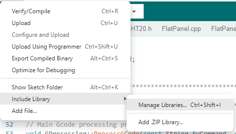

Type TMCStepper into the search box and then install the latest version.

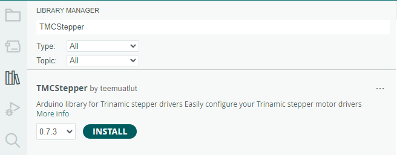

The console in the bottom right will show success when installation is successful. 

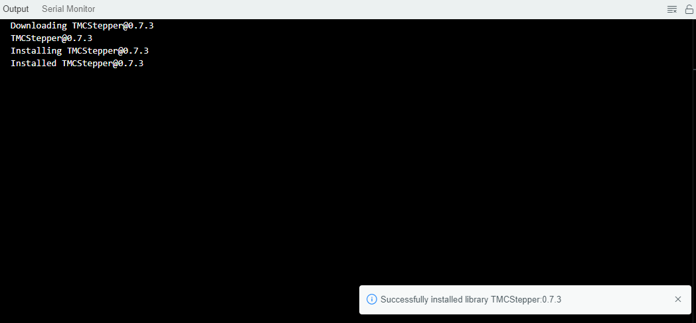

### Download and Unzip Realta EBB42 telescope focuser repository

Now we need to download the code and other files in this repository, on the main page there is a green "<> Code" button.

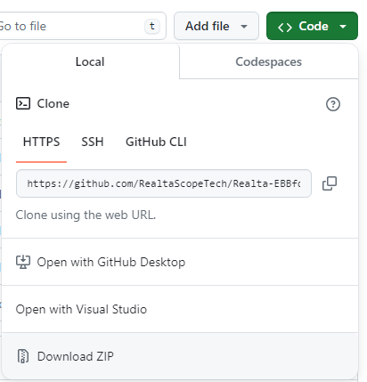

clicking it will give you the oprion to download a zip file, click that. This will result in a zip folder appearing in your downloads folder, right click on that an choose "Extract All..."

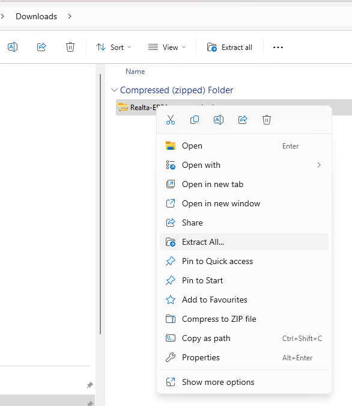

This will show a dialog box asking you where to unzip the file, leave the defaults but do click the "Shpw extracted files when complete" and click the "Extract" button

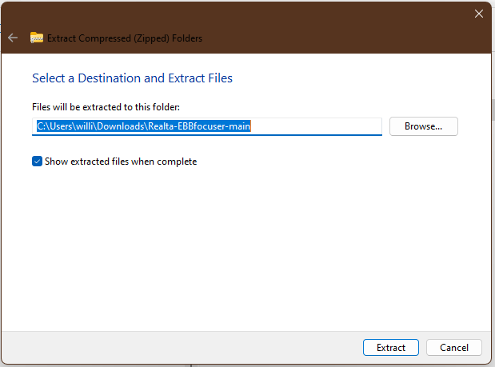

This should open a window showing a file structure similar to the image below.

### Compiling and uploading source files using Ardunio IDE.

Show tick and arrow 

describe difference

Show how to set EBB42 into programming mode.

### Alternatively uploading pre-compiled binaries using STMCubeProgrammer software.

Can just open bin file and upload it using STMCubeProgrammer, still need to set EBB42 into programming mode.

## Compiling ASCOM driver from source code.

### Download Visual Studio Community

Visual studio comunity is a free version of visual studio

https://visualstudio.microsoft.com/downloads/

Clicking the "Free download" button will take you to another site that will automatically start downloading the application. As its a ".exe" file your web browser might ask for your permission.

When VS studio Community starts to install it will ask you questions about what you want to use it for, answer x, y, x

### Run as administator

Explain its a DLL and need to be admin to register it in windows

### Open project

In the earlier step you downloaded the Realta EBB42 telescope focuser repository, the VS project is located in that repository in folder XYZ, open the file named todo_file_name.

### Configure for "Any CPU"

Who how to change to "Any CPU" compiler. Todo need to check this actually works for a fresh install otherwise ask to compile for x64 unless they know they are running an older CPU. 

### Rebuild project

Show screen shots of rebuilding.

### Alternatively using pre-compiled ASCOM driver installer.

## How to use ASCOM driver (Using N.I.N.A).

## Notes about INDI linux driver.

Lol I don't know how!
