# Realta Scope Tech EBB42 telescope focuser

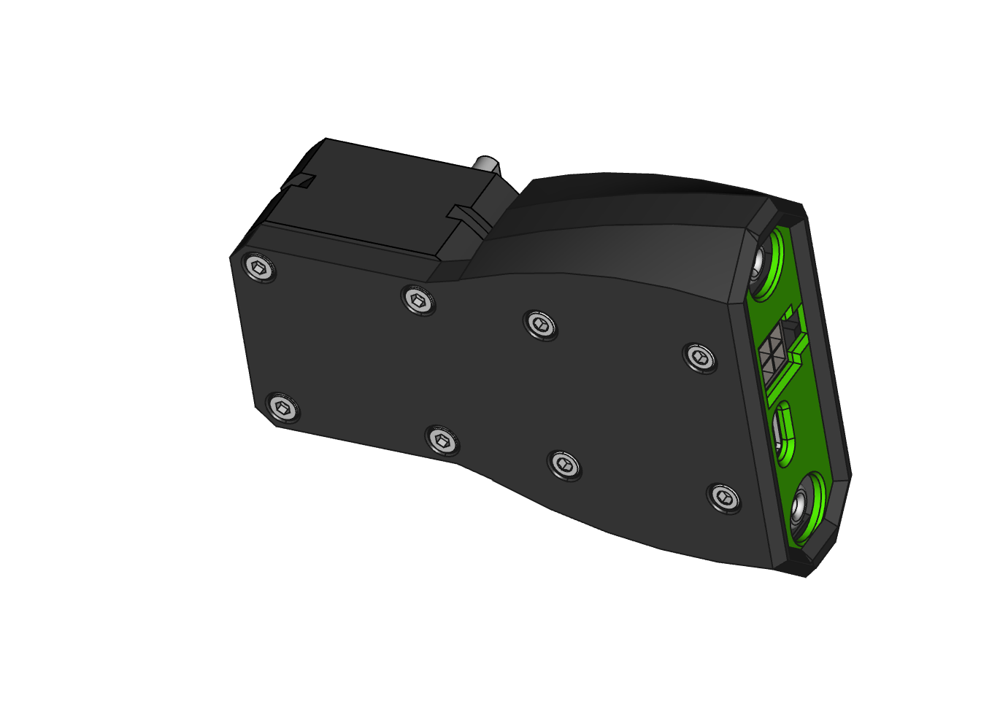

## Project goals.

+ Truley open source code i.e. do what you want with it.
+ Using open hardware only i.e. schematic available.
+ Firmware created using Arduino IDE with full guide to get it working with the EBB42.

## What you need to buy.

### Stepper motor

I have used a 23mm thick Nema 17 stepper motor like this 17HS4023. 

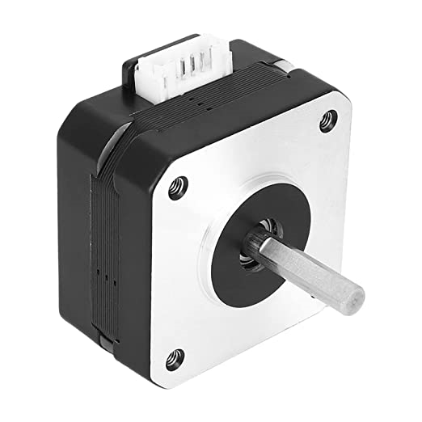

However, any NEMA stepper motor thicker than this will work but you are limited to 1.5A per phase by the EBB42 stepper motor driver. Even thinner motors will work but you will have a hard time mounting them as the case will foul most mounting brackets. The FreeCAD file containing the parts is included in this repository so can be edited to provide a spacer to pad out the difference in width if needed. 

### BigTreeTech EBB42 

There are two versions of this, one with an accelerometer and one without, both will work but the accelerometer version is twice as expensive and no use of it is made in this project. 

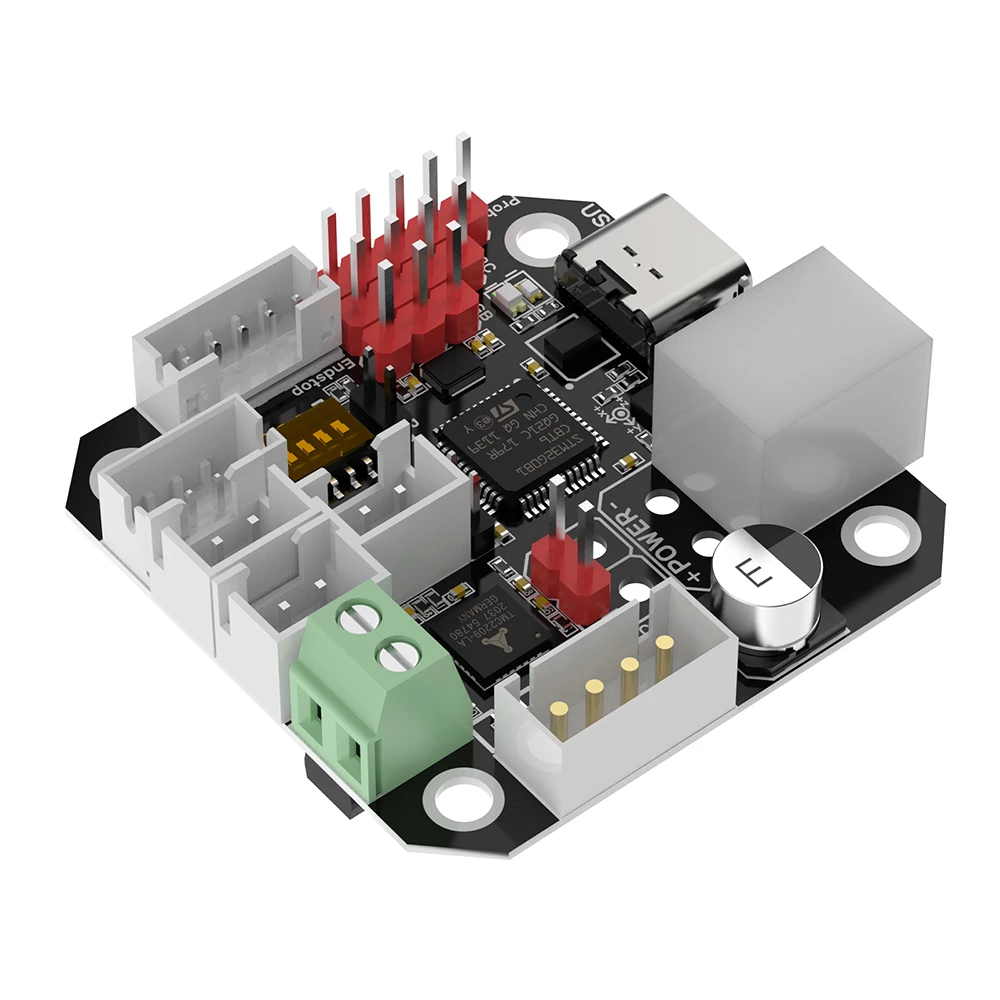

### M3 Hex bolts

To secure the EBB42 you will need 4 12mm long M3 bolts while the ones for the stepper motor depend on how thick the one you buy is. The original bolts will not reach through the combined thickness of the case and motor so you will need 4 replacement ones. I found that for the 23mm thick motor I could use 22mm long bolts.  

### Optional: RCA connectors

If you want to use the dew heaters then you will need these RCA connectors.

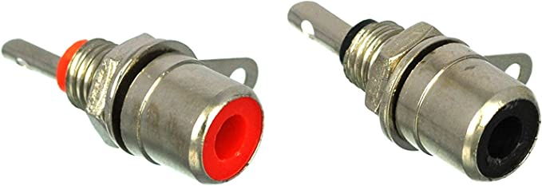

### Optional: Crimping tools and ferrules

The EBB42 focuser comes with all the accessories you need to connect it up it comes with the cable fittings needed to be added to wires to fit in its sockets and the metal pins too. However you will need to crimp these onto the wires yourself and a dupont compatable crimping tool greatly helps.

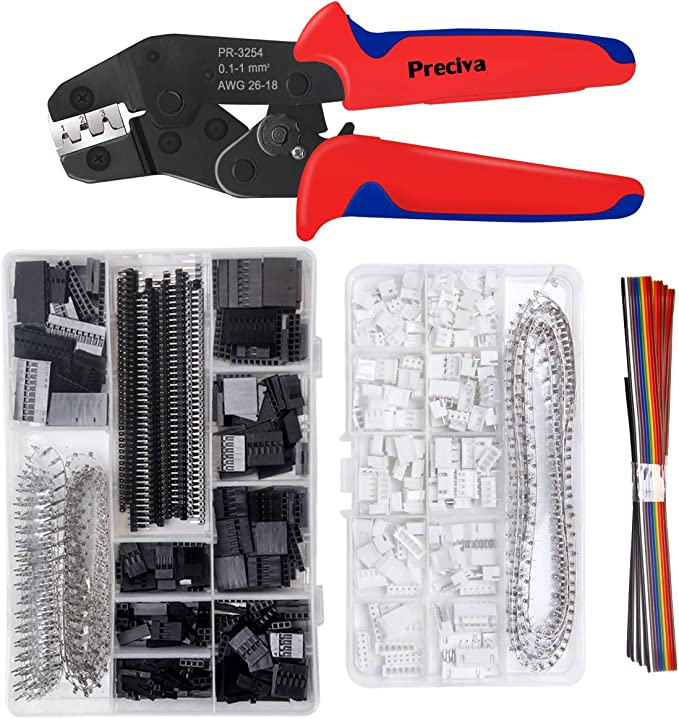

However it is possible to crimp using Needle Nose Pliers. 

I also made use of ferrules for terminating the dew heater wires used in the screw terminals.

## What you need to 3D print.

Only two parts need to be printed. Neither part requires supports and they were designed to be printed easily on a printer using an 0.8mm nozzle so should be easy prints on any printer using a smaller nozzle. 

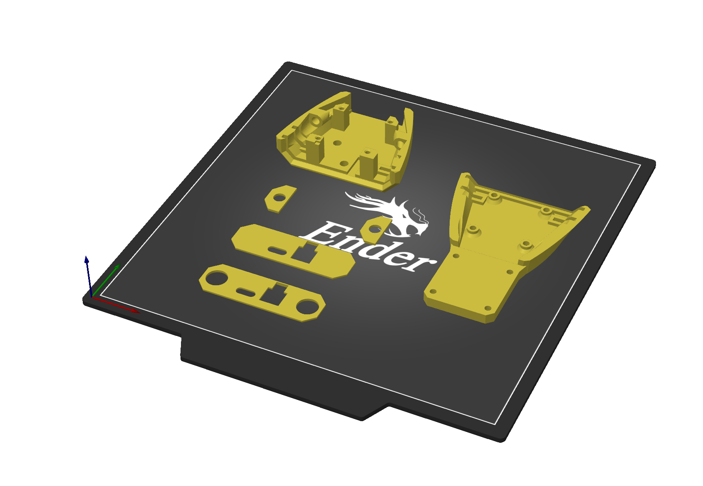

### Notes on filament type.

Stepper motors will get warm when opperating and even when not moving they are being held in place by powered magnetic fields. They are designed to cope with very very high temperatures. The firmware provided does make use of the TMC2209's CoolStep technology which greatly lowers the current drawn when not moving however the motor will still get warm to the touch, around 40c to 50c are common. This means you really should think twice about using a filament such as PLA which will start going floppy around this temperature. PETG would be better but ABS or ASA would be best. 

## Assembling the case.

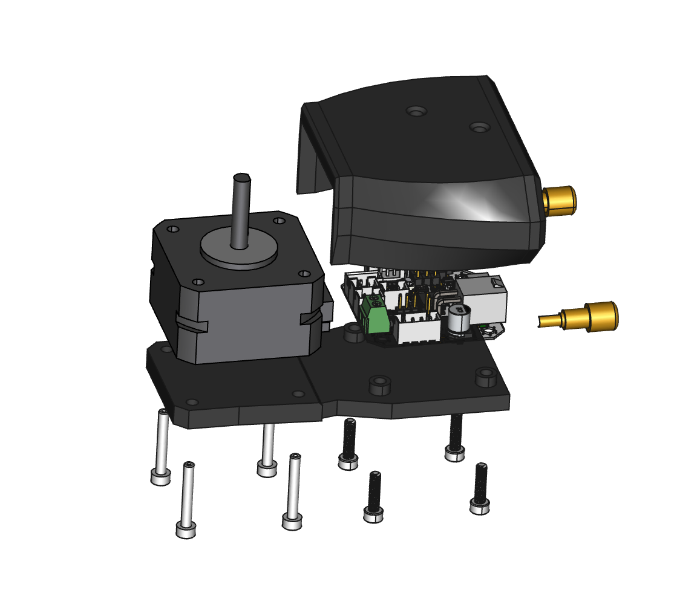

### Step 1: RCA Connectors (Optional)

If you plan on using the dew heater functionality you must fit them first as the EBB42 PCB will block access once its secured.

### Step 2: Attach stepper motor wires to EBB42 PCB

### Step 3: Fit EBB42 PCB

### Step 4: Secure base plate to case using 4 M3 12mm bolts.

### Step 5: Remove existing bolts from stepper motor

### Step 6: Attach stepper motor wires (if needed)

### Step 7: Secure motor to base plate using appropriate M3 bolts.

## Setting up the Ardunio IDE for use with EBB42.

### Install the Arduino IDE.

The latest Ardunio IDE can be found here.

https://www.arduino.cc/en/software

When you start the IDE for the first time you will be asked to allow it access to the internet, please allow it to do this as it will download various drivers and you will need this functionality later on to install some libaries. 

### User board manager to add stm32duino

Use the "tools" menu at the top to add the STM32 boards to the IDE.

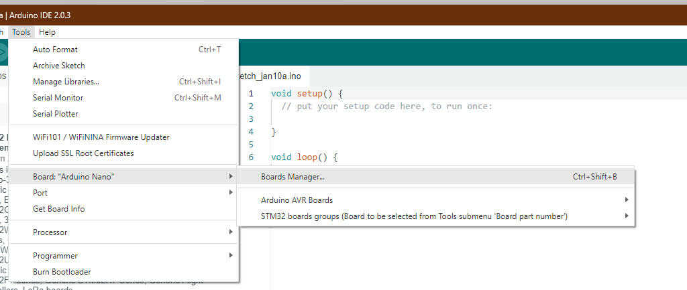

This opens a panel on the left hand side, in this search for "STM". 

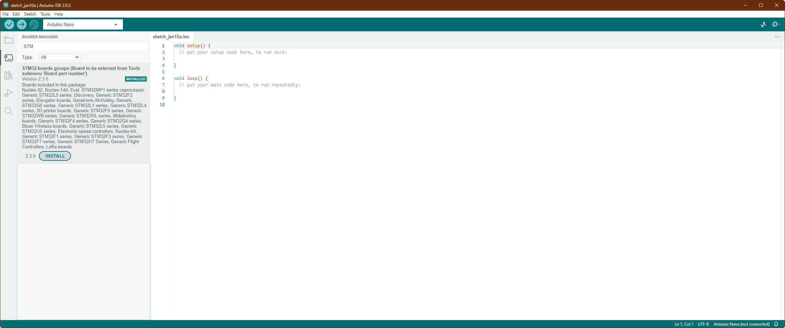

Please note the version in the bottom left hand corner, if this is 2.4.0 or later then thats great however, if its not then 2.4.0 still hasn't been released and you will need to download the latest version from GitHub. 

### If still version 2.3.0 then follow these extra steps

#### (2.3.0 Extra steps) Go to the Arduino STM hardware folder and delete files.

Paste this into a windows explorer address bar 

%LocalAppData%\Arduino15\packages\STMicroelectronics\hardware\stm32\2.3.0

Highlight all of the files and delete them.

#### (2.3.0 Extra steps) Download the latest stm32duino

Download the files from the stm32duino github repository https://github.com/stm32duino/Arduino_Core_STM32

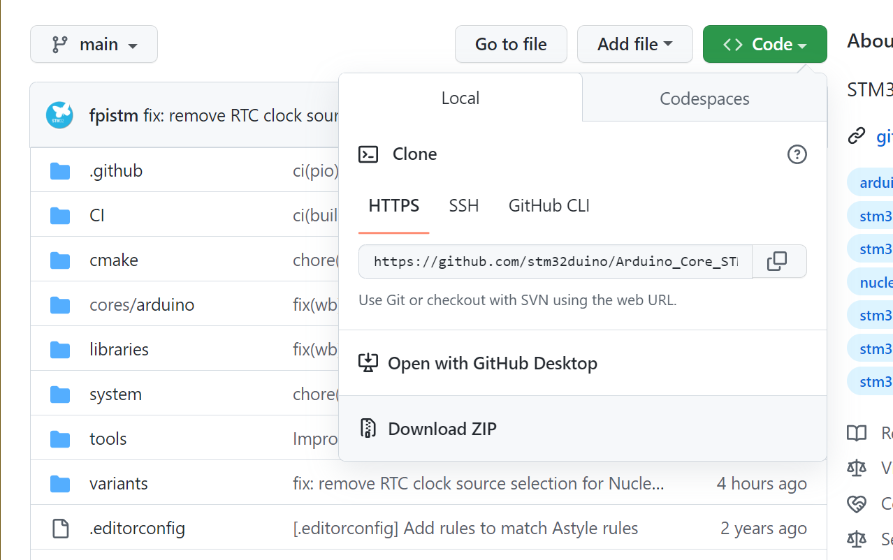

#### (2.3.0 Extra steps) Unzip downloaded file and copy its contents

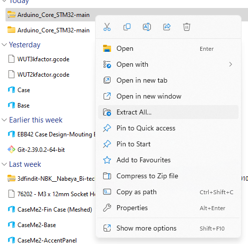

Highlight all of the unzipped files and copy them

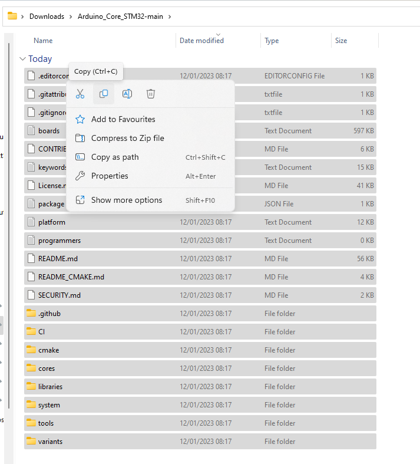

#### (2.3.0 Extra steps) Paste files into Arduino STM hardware folder

Now select the other windows explorer window and paste the files.

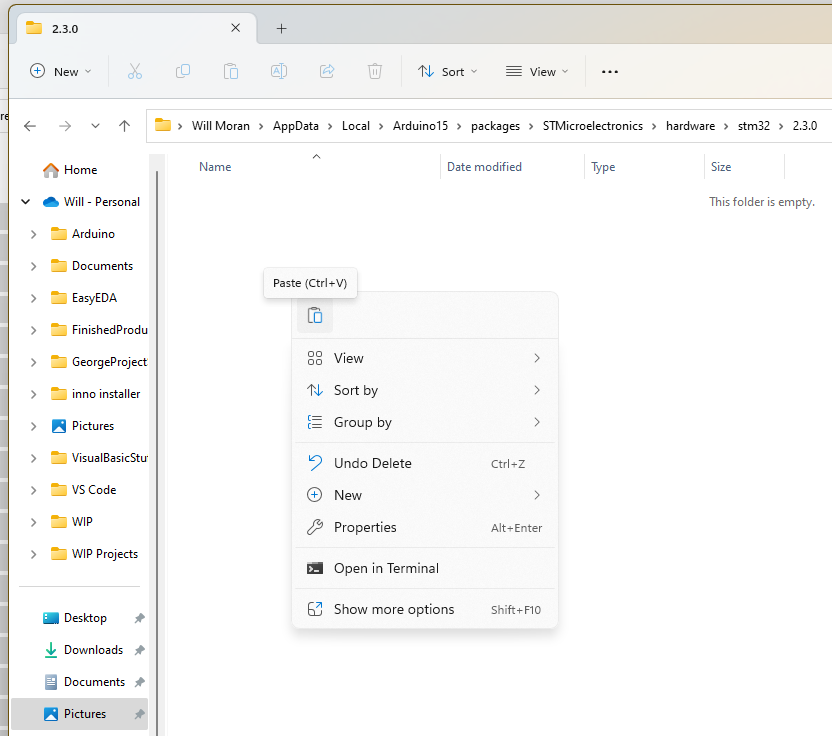

#### (2.3.0 Extra steps and maybe 2.4.0 and beyound?) Fix bug stopping EEPROM from working.

The current stm32duino entry for the EBB42 board doesn't allow you to use the built in EEPROM storage so we need to edit a file to allow this. When 2.4.0 is released this might be fixed but its worth checking anyway.

Open and explorer windown and go to folder 

%LocalAppData%\Arduino15\packages\STMicroelectronics\hardware\stm32\2.3.0\variants\STM32G0xx\G0B1C(B-C-E)(T-U)_G0C1C(C-E)(T-U)

In this folder there should be a file called variant_EBB42_V1_1.h, we need to edit this so right click on it, windows probably wont know what to do with this type of file so you need to select "choose another app".

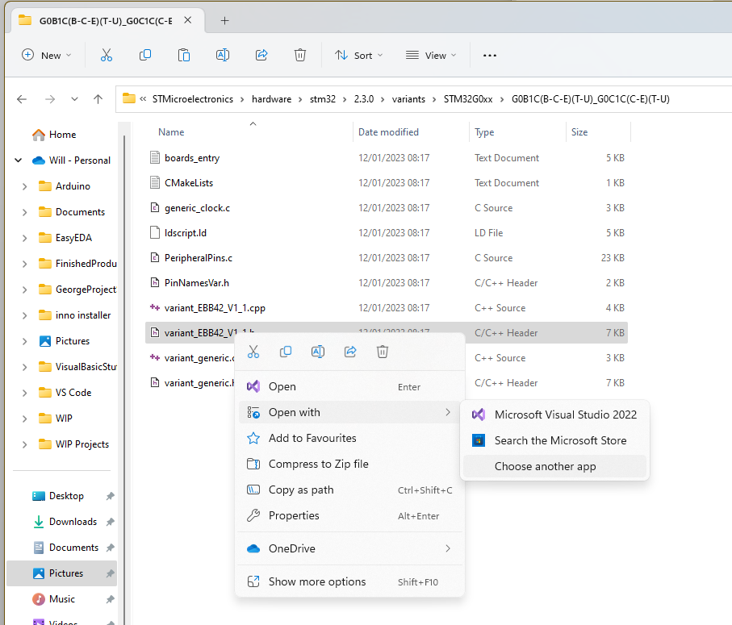

And select notepad from the list

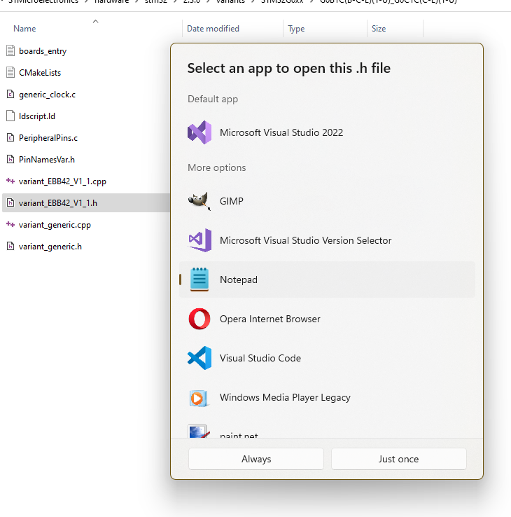

You then need to paste in the follow text 

#define FLASH_BANK_NUMBER       FLASH_BANK_1

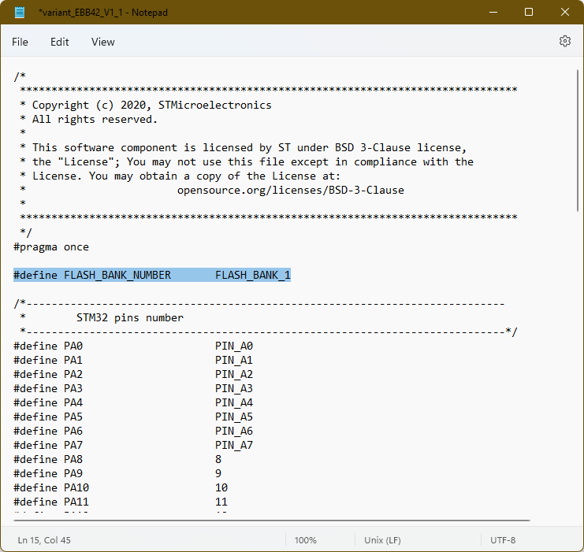

Save the file and we are done setting up the 2.3.0 Extra steps.

### Select the board in Arduino IDE

Back in the Arduino IDE use the menus to finally select the EBB42 board. 

First select the menu item "3D printer boards"

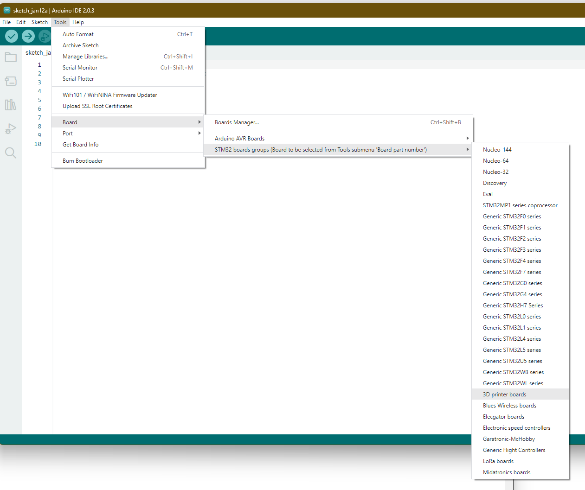

Then use the newly added menus to select the board part number 

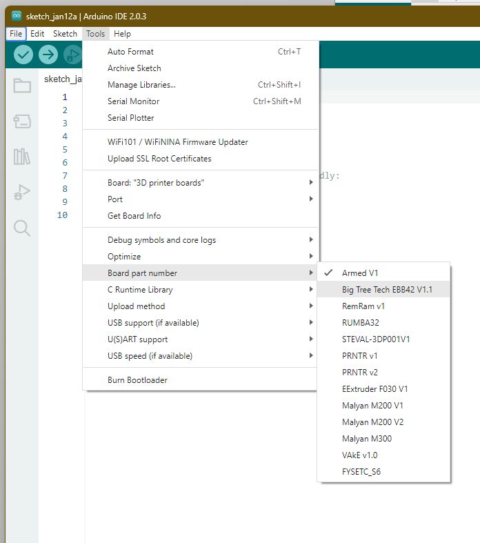

And upload method

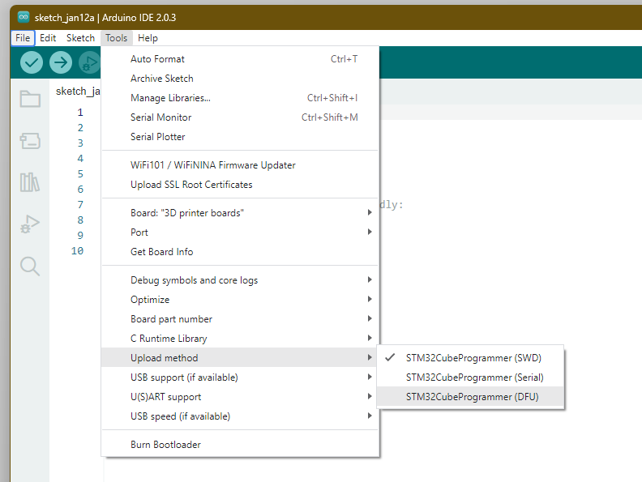

Finally the board is ready to be used in Arduino IDE!

### Install STM32CubeProgrammer

We still aren't done installing software, when the Arduino IDE uploads the file to the EBB42 board it will first try to compile it and when it does that it reaches out to the STM32 compiler which wont exist yet on your computer! In order for this to work we need to install STM32CubeProgrammer which can be downloaded from.

https://www.st.com/en/development-tools/stm32cubeprog.html

### Adding in required linbraries.

Add picture of menu option

Add search

Need only TMCStepper? 

### Download and Unzip Realta EBB42 telescope focuser repository

Show image of download link

Show unzip a file

### Compiling and uploading source files using Ardunio IDE.

Show tick and arrow 

describe difference

Show how to set EBB42 into programming mode.

### Alternatively uploading pre-compiled binaries using STMCubeProgrammer software.

Can just open bin file and upload it using STMCubeProgrammer, still need to set EBB42 into programming mode.

## Compiling ASCOM driver from source code.

### Download Visual Studio Community

Visual studio comunity is a free version of visual studio

https://visualstudio.microsoft.com/downloads/

Clicking the "Free download" button will take you to another site that will automatically start downloading the application. As its a ".exe" file your web browser might ask for your permission.

When VS studio Community starts to install it will ask you questions about what you want to use it for, answer x, y, x

### Run as administator

Explain its a DLL and need to be admin to register it in windows

### Open project

In the earlier step you downloaded the Realta EBB42 telescope focuser repository, the VS project is located in that repository in folder XYZ, open the file named todo_file_name.

### Configure for "Any CPU"

Who how to change to "Any CPU" compiler. Todo need to check this actually works for a fresh install otherwise ask to compile for x64 unless they know they are running an older CPU. 

### Rebuild project

Show screen shots of rebuilding.

### Alternatively using pre-compiled ASCOM driver installer.

## How to use ASCOM driver (Using N.I.N.A).

## Notes about INDI linux driver.

Lol I don't know how!
