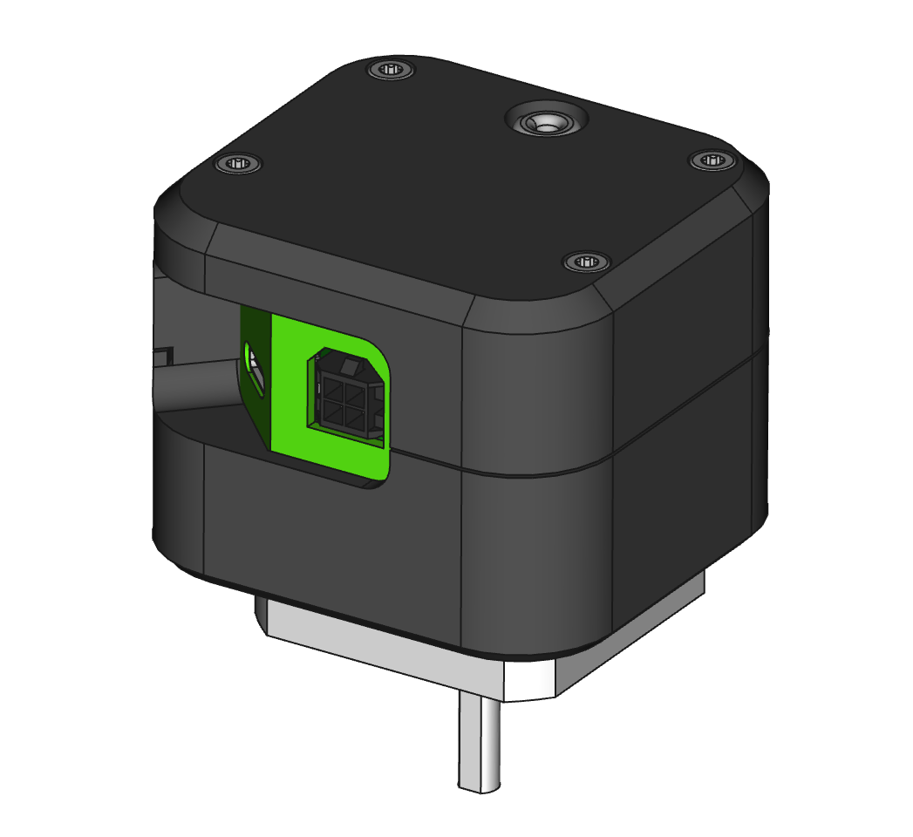

# Realta Scope Tech EBBfocuser adapted to drive a peristaltic pump.

Connect PWM output to EBB36 pin (??). The PWM frequency determines the stepper's rotation speed and thus the pump output.

# Realta Scope Tech EBBfocuser

Welcome to the Realta EBBfocuser Project! This initiative is dedicated to creating a precise, customizable, and open-source focuser for telescopes. By leveraging the power of the maker community and freely available hardware, we've developed a solution that promotes collaboration and innovation.

## Project Overview

The heart of our project is the Bigtree Tech EBB36, a versatile stepper motor driver and microcontroller. This component is combined with a 3D printed case, custom firmware developed using the Arduino IDE, and a Windows driver built on the ASCOM framework. Together, these elements create a powerful and user-friendly telescope focuser designed for makers and enthusiasts who value customization and open-source principles.

## Key Components

**Bigtree Tech EBB36:** This stepper motor driver and microcontroller serves as the brain of our focuser, providing precise control over the telescope's focusing mechanism.

**3D Printed Case:** The case, designed to house the EBB36 and other components securely, can be easily printed using any standard 3D printer. It ensures the electronics are protected while maintaining accessibility for adjustments and upgrades.

**Arduino IDE Firmware:** Our custom firmware, developed in the Arduino IDE, allows for seamless communication between the EBB36 and the focusing mechanism. The firmware is open source, enabling users to modify and improve it according to their needs.

**ASCOM Framework Driver:** The ASCOM (Astronomy Common Object Model) framework driver ensures compatibility with a wide range of astronomy software, providing a standardized interface for controlling the focuser through a Windows environment.

## Features and Benefits

**Open Source:** All aspects of the Realta EBBfocuser, from the firmware to the case design, are open source. This allows users to freely modify, enhance, and share improvements, fostering a collaborative community.

**Maker-Centric Design:** The project is designed with makers in mind. Whether you enjoy 3D printing, coding, or electronics, the Realta EBBfocuser offers numerous opportunities to get hands-on and customize your setup.

**Precision:** The Bigtree Tech EBB36 offers high precision control, essential for achieving sharp focus in astrophotography and observation.

**Compatibility:** With the ASCOM driver, our focuser can be easily integrated with a wide array of existing astronomy software, enhancing its usability and versatility.
Getting Started

## To get started with the Realta EBBfocuser Project, you will need:

+ A Bigtree Tech EBB36 stepper motor driver and microcontroller
+ A 3D printer to print the custom-designed case
+ Basic electronics tools and components
+ The Arduino IDE for firmware installation and customization
+ A Windows PC for installing the ASCOM driver and controlling the focuser

We invite you to join our community, contribute to the project, and share your experiences. By working together, we can push the boundaries of what's possible in telescope focusing, making advanced astrophotography and observation more accessible to everyone.

The full guide to completing this project can be found here.

[Realta EBBfocuser complete guide](/Guide/ReadMe.md)
